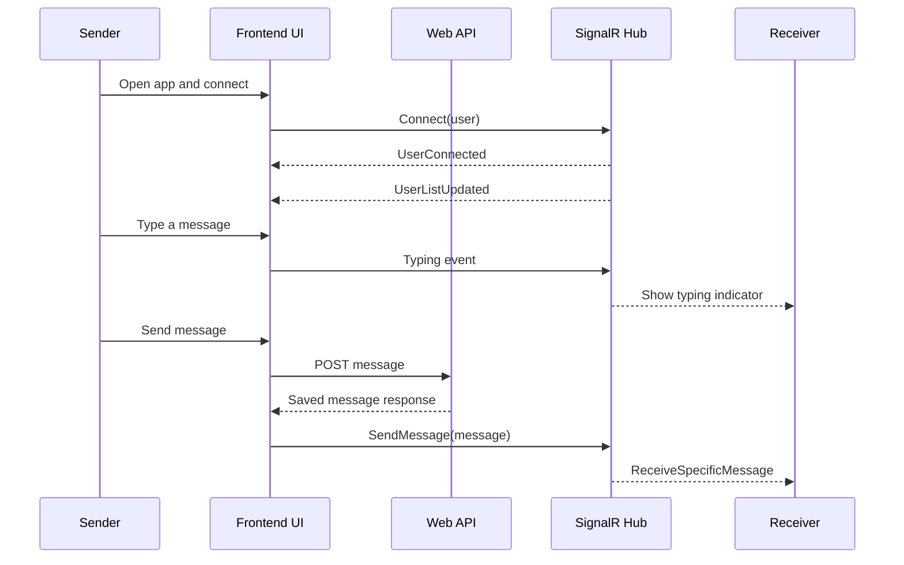

```mermaid
sequenceDiagram
    participant U1 as Sender
    participant UI as Frontend UI
    participant API as Web API
    participant HUB as SignalR Hub
    participant U2 as Receiver

    U1->>UI: Open app and connect
    UI->>HUB: Connect(user)
    HUB-->>UI: UserConnected
    HUB-->>UI: UserListUpdated

    U1->>UI: Type a message
    UI->>HUB: Typing event
    HUB-->>U2: Show typing indicator

    U1->>UI: Send message
    UI->>API: POST message
    API-->>UI: Saved message response
    UI->>HUB: SendMessage(message)
    HUB-->>U2: ReceiveSpecificMessage
    
```
